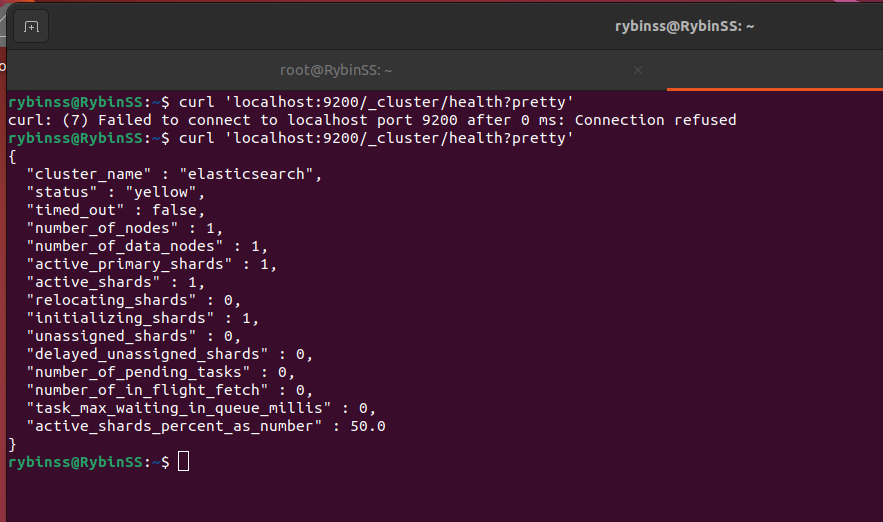
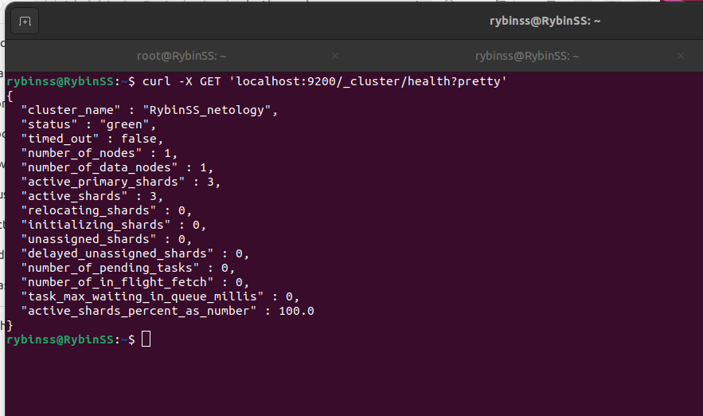
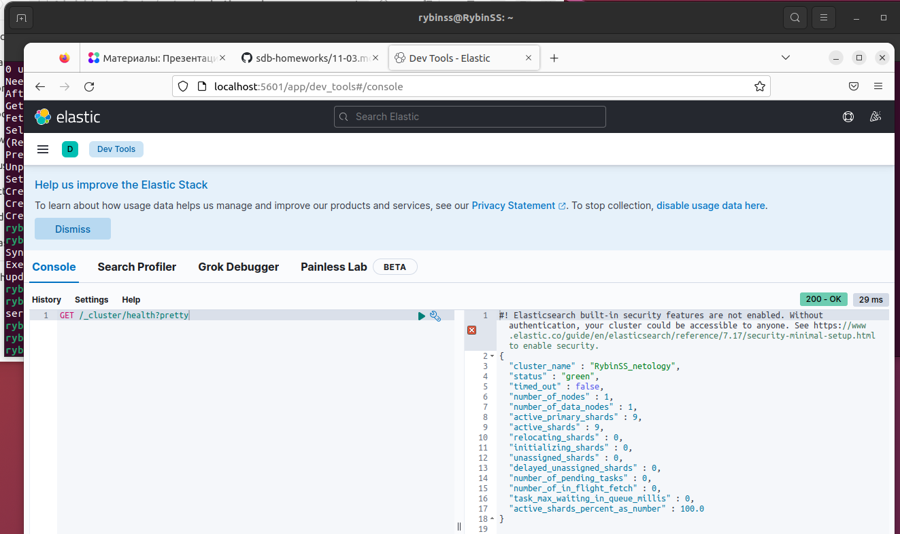
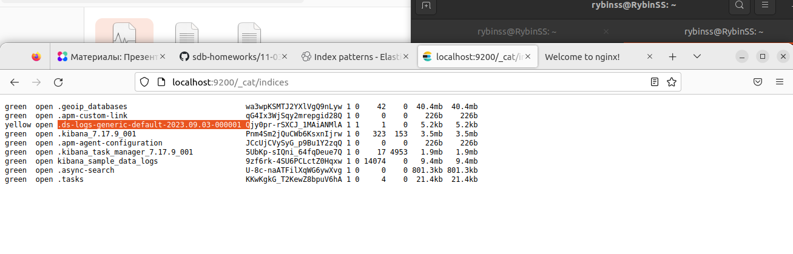
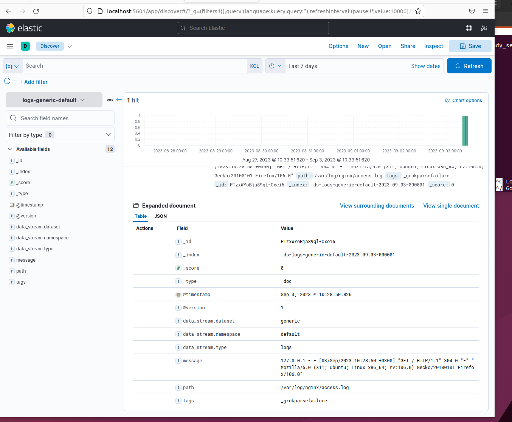
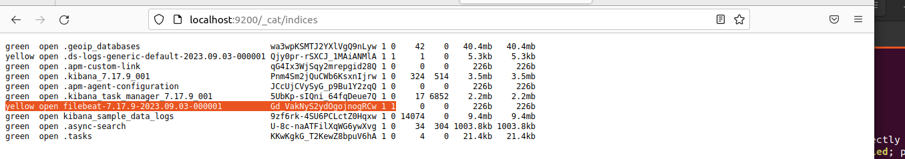
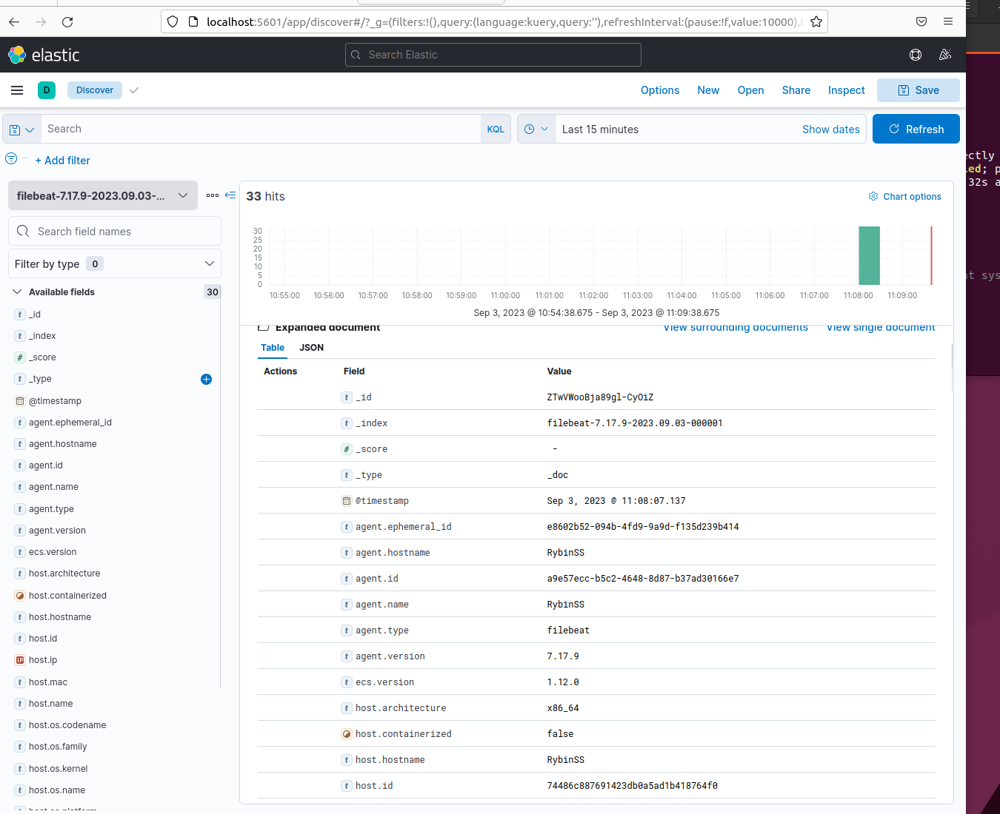

# elk

### Задание 1 Elasticsearch

`Установите и запустите Elasticsearch, после чего поменяйте параметр cluster_name на случайный.`

  
  

### Задание 2 Kibana

`Установите и запустите Kibana.`

  

### Задание 3 Logstash

`Установите и запустите Logstash и Nginx. С помощью Logstash отправьте access-лог Nginx в Elasticsearch.`

  
  

### Задание 4 Filebeat.

`Установите и запустите Filebeat. Переключите поставку логов Nginx с Logstash на Filebeat.`

  
  

